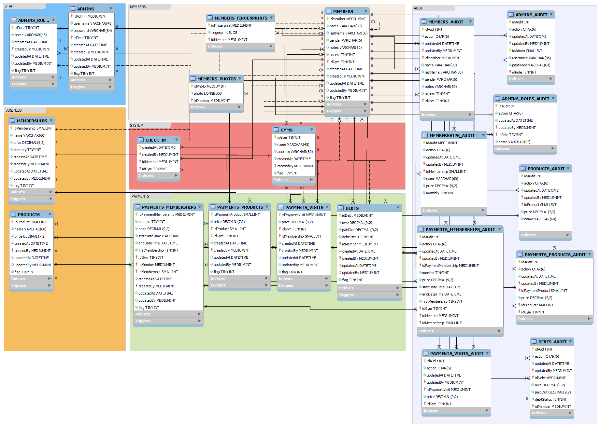

# Armstrong Desktop

_**Sistema de administración para gimnasios**_

_Made with love, made with **[JavaFX](https://openjfx.io/)**_

# Contenido

- [Características](#características)
- [Tecnologías](#tecnologías)
- [Configuración inicial](#configuración-inicial)
- [Corriendo el proyecto](#corriendo-el-proyecto)
- [Documentación-general](#documentación-general)
    - [Archivo inicial para construir la aplicación general](#archivo-inicial-para-construir-la-aplicación)
    - [Digitalpersona 4500U](#digitalpersona-4500U)
    - [Modelo de la base de datos 4500U](#modelo-de-la-base-de-datos)
    - [Vistas y controladores](#vistas-y-controladores)
- [Pantallas de la aplicación](#pantallas-de-la-aplicación)

# Características

- Multiplataforma.
- Soporta la administración de varios gimnasios.
- Soporte para el lector digitalpersona 4500U (lector de huellas) **(opcional)**.
- Consultas asíncronas (puede trabajar con un servidor remoto sin congelar la interfaz) además de contar con un pooling de conexiones para correr varias consultas en paralelo.
- Auditoría avanzada sobre la información y sus cambios.
- Temas en blanco / negro.

# Tecnologías

- Java 11 - Lenguaje de programación utilizado en todo el proyecto.
- MySQL 8.0.29 - Base de datos.
- JavaFX - La cara bonita de la aplicación.
- Workbench - Herramienta utilizada para crear el modelo de la base de datos.
- SceneBuilder - Herramienta utilizada para crear las pantallas de la aplicación.

## Librerías

- [Ikonli](https://github.com/kordamp/ikonli) - Íconos.
- [AnimateFX](https://github.com/Typhon0/AnimateFX) - Animaciones.
- [JFoenix](https://github.com/sshahine/JFoenix) - Estilos material design.
- [HikariCP](https://github.com/brettwooldridge/HikariCP) - Pooling de conexiones de la base de datos.

# Configuración inicial

### Creando la base de datos

Cargamos el archivo [armstrong.sql](database/armstrong.sql) en nuestro servidor, suponiendo que nuestro servidor es local y nuestro usuario es root (**no recomendado**) con mysql en las variables de entorno, los comandos son los siguientes

```
armstrong\database> mysql -u root -p --default-character-set=utf8mb4
mysql> source armstrong.sql
```

También he dejado el modelo de la base de datos hecha en [workbench](database/armstrong.mwb) en la misma carpeta, por si desean agregar / cambiar entidades, o correr el script sql desde ahí.

### Configurando el entorno

La aplicación puede trabajar en dos entornos, dichos entornos se encuentran en el archivo de [preferencias](src/main/java/com/ocielgp/app/UserPreferences.java) ubicado:

```
# En el proyecto
src/main/java/com/ocielgp/app/UserPreferences.java
# En los registros (windows)
Computer\HKEY_CURRENT_USER\Software\JavaSoft\Prefs\com\ocielgp\app
```

> **DB_SOURCE** Determina a que servidor nos vamos a conectar (0 o 1), simplemente verificamos que las credenciales coincidan al entorno que nos vamos a conectar
<!-- -->
> Después de ejecutar el proyecto por primera vez las preferencias se guardarán en los registros, si realizamos alguna modificación en UserPreferences.java, tenemos que borrar la preferencia **THEME** en los registros del sistema, para que al volver a correr la aplicación se generen nuevamente las preferencias.

# Corriendo el proyecto

Parar correr el proyecto necesitaremos las siguientes cosas:

- Los **bin**arios de Java 11 (o superior) en las variables de entorno.
    - Puede ser el JDK proporcionado por Oracle, en este proyecto se utilizó el [JDK proporcionado por Amazon](https://docs.aws.amazon.com/corretto/latest/corretto-11-ug/downloads-list.html).
- Los **bin**arios de Maven en las variables de entorno.
    - Se pueden descargar desde el siguiente [link](https://maven.apache.org/download.cgi) (**verificar que sean los binarios**).
- Realizar la configuración inicial.

### Comando para correr la aplicación

Para correr el proyecto, tenemos las siguientes opciones:

- [Opción 1]: Ejecutamos el archivo [RunArmstrong.bat](RunArmstrong.bat) (windows).
- [Opción 2]: En una terminal situada en la carpeta raíz del proyecto donde se encuentra el [pom.xml](pom.xml), corremos el siguiente comando:

```
armstrong> mvn javafx:dorun
```

Si todo sale bien, saldrá la pantalla del login de la aplicación con una notificación diciendo conexión establecida, las siguientes son las credenciales para entrar:

```
usuario: sistema
contraseña: 123
```

# Documentación general

El proyecto es grande, pero está dividido para que sea escalable, así que explicaré las cosas más importantes para que si deseas modificar algo, tengas nociones generales de él.

## Archivo inicial para construir la aplicación

Todo empieza creando un **stage**, cosas como el cargado de estilos, la pantalla inicial de la aplicación e inicialización de cosas básicas como la conexión a la base de datos o el sistema de notificaciones, empiezan en [RunApp](src/main/java/com/ocielgp/RunApp.java).

## Digitalpersona 4500U

Ahora el proyecto se diseñó para trabajar con este lector en específico, el proyecto ya tiene la librería para trabajar con él, pero es importante tener los drivers instalados para que la aplicación lo reconozca, los drivers del lector los puedes descargar [aquí](https://www.bayometric.com/fingerprint-sensor-driver/) dependiendo de tu sistema operativo, una vez instalados reincia la computadora y corre la aplicación, el lector se conectara automáticamente.
> **Nota:** La aplicación puede trabajar sin el lector, la diferencia es que se ocultará la opción de registrar huellas.

## Modelo de la base de datos

La aplicación tiene un archivo de modelado (hecho en workbench) de la base de datos, donde puedes realizar modificaciones y generar el script sql rápidamente, además de que tienes una vista completa sobre el proyecto, de aquí nacen todos los [modelos](src/main/java/com/ocielgp/models) y sus respectivos [dao](src/main/java/com/ocielgp/dao).

> Además, el proyecto cuenta con una auditoría avanzada con triggers en las tablas principales que registraran cambios en la información en su tabla espejo (las que se encuentran en la sección **audit**) registrando cada cambio y el autor de dicho cambio.

## Vistas y controladores

El proyecto fue creado bajo el patrón MVC (Model-View-Controller).

### Vistas

Todas las vistas de la aplicación se encuentran en [resources/views](src/main/resources/views), para editar las vistas de manera visual se necesita SceneBuilder configurando de la siguiente manera

- Utilizar la versión **SceneBuilder 15**, algunas librerías presentan problemas en versiones superirores, para descargar aquí esta un [link](https://download2.gluonhq.com//scenebuilder/15.0.0/install/windows/SceneBuilder-15.0.0.msi) (ya que no aparece en su página oficial de manera directa).
- Instalar las siguientes librerías en SceneBuilder
    - **jfoenix**
        - **groupId** com.jfoenix
        - **artifactId** jfoenix
        - **version** 9.0.10
    - **ikonli**
        - **groupId** org.kordamp.ikonli
        - **artifactId** ikonli-javafx
        - **version** 12.3.1
    - **ikonli material pack**
        - **groupId** org.kordamp.ikonli
        - **artifactId** ikonli-material-pack
        - **version** 12.3.1

### Controladores

La aplicación cuenta con un [router](src/main/java/com/ocielgp/app/Router.java) creado desde cero para cambiar entre las diferentes pantallas, todos los controladores de las vistas se encuentran en el directorio [controller](src/main/java/com/ocielgp/controller).

# Pantallas de la aplicación

## Tema blanco

### Inicio


### Resumen


### Socios


### Entradas


### Admins


### Modo seguro


## Tema negro

### Inicio


### Resumen


### Socios


### Entradas


### Admins


### Modo seguro


